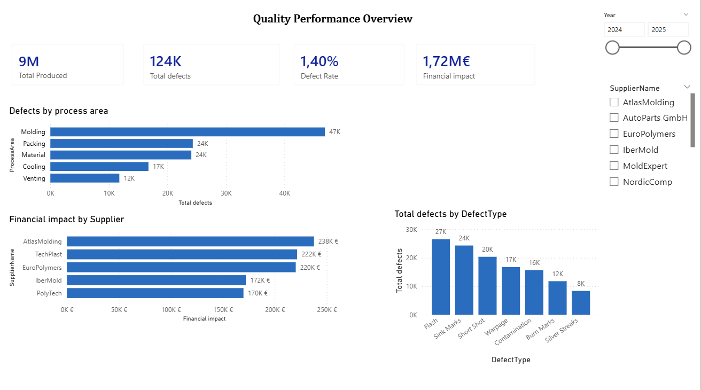
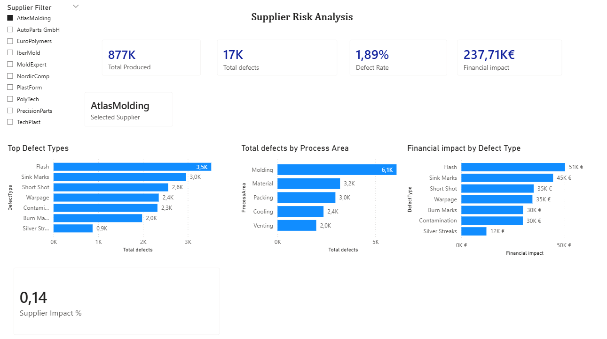
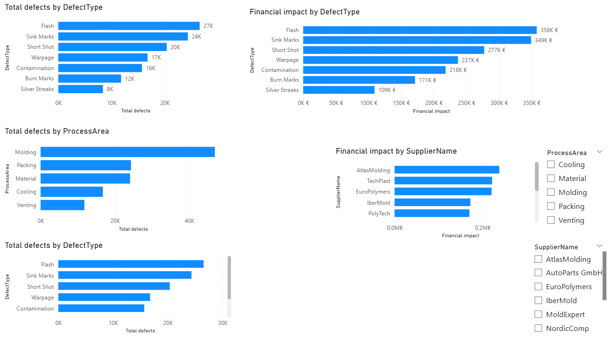

# Supplier Quality Analysis – Power BI

This project analyzes supplier quality performance in a plastic injection manufacturing environment.  
The goal is to identify high-risk suppliers, understand the main defect drivers, and quantify the financial impact of quality issues.

## Business Objective
- Identify suppliers with the highest quality risk  
- Detect the main processes generating defects  
- Understand which defect types drive costs  
- Support data-driven supplier improvement actions

---

## Dashboards

### Overview

### Supplier Analysis

### Root Cause Analysis

## Key KPIs
- Total Produced: 9M units  
- Total Defects: 124K  
- Defect Rate: 1.4%  
- Financial Impact: €1.72M  

## Main Insights
- **AtlasMolding** is the highest-risk supplier (highest defect rate and financial impact)
- The **Molding** process generates the largest number of defects
- **Flash** is the most critical defect type in both volume and cost

## Tools & Skills
- Power BI
- Power Query (Data Transformation)
- DAX Measures
- Data Modeling
- Data Visualization & Dashboard Design

## Files
- `supplier_quality_data.pbix` – Power BI report  
- `Supplier_Quality_Data.xlsx` – Dataset  

## Author
Inês
